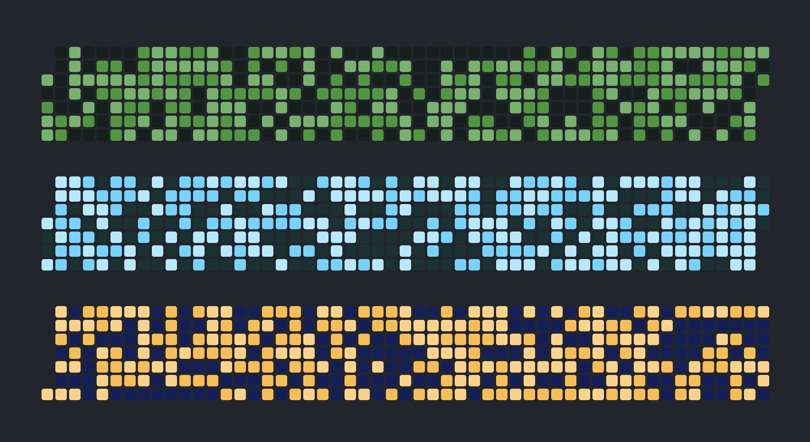

<h1 align="center">
  @react-sandbox/heatmap
</h1>

<p align="center">
  
  
  
</p>

<p align="center">
  
</p>

<p align="center">
  📅🔥 Calendar heatmap component
</p>

<p align="center">
  Customizable SVG inspired by GitHub's contribution graph.
</p>

### Install

Install the `@react-sandbox/heatmap` package:

```
npm install @react-sandbox/heatmap
```

### Import

Import the `Heatmap` component:

```tsx
import React from 'react'
import Heatmap from '@react-sandbox/heatmap'

function App() {
  return <div></div>
}
```

### Props

TODO

## Development

### Local

```
pnpm install
pnpm dev
```

### Tests

TODO

### Example

Inside `test/`:

```
pnpm install
pnpm dev
```

## License

MIT
